# Silly Little Hats

Renders certain items as hats when worn on your head.

### Dependencies

- [DragonFly](https://github.com/UselessSolutions/DragonFly)

## Modified Blocks

To use these just place the block on your head

|                                      |                                |                             |
|:------------------------------------:|:------------------------------:|:---------------------------:|
|              **Arrows**              |           **Layers**           |          **Doors**          |
|              |      | 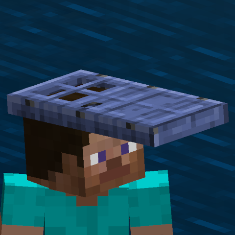 |
|                                      |                                |                             |
|            **Trapdoors**             |           **Slabs**            |         **Stairs**          |
|   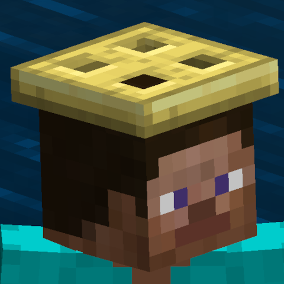    |    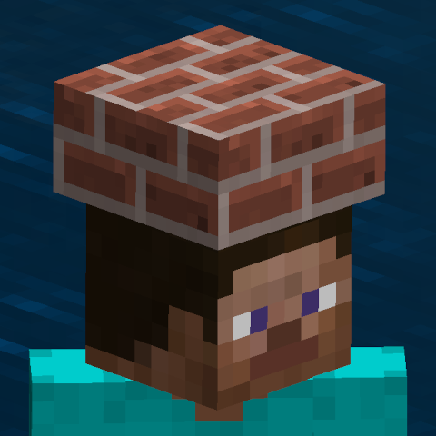     |  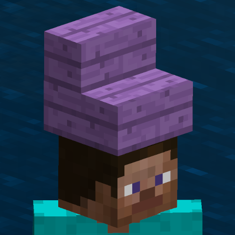  |
|                                      |                                |                             |
|              **Swords**              |           **Button**           |         **Basket**          |
|      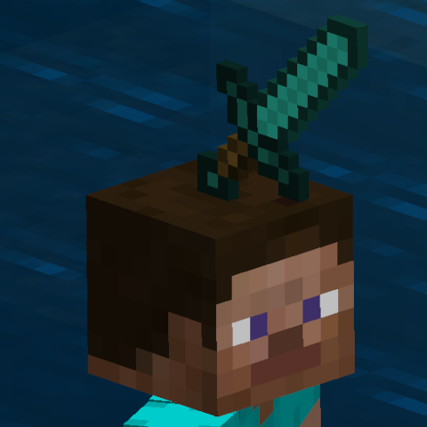       |   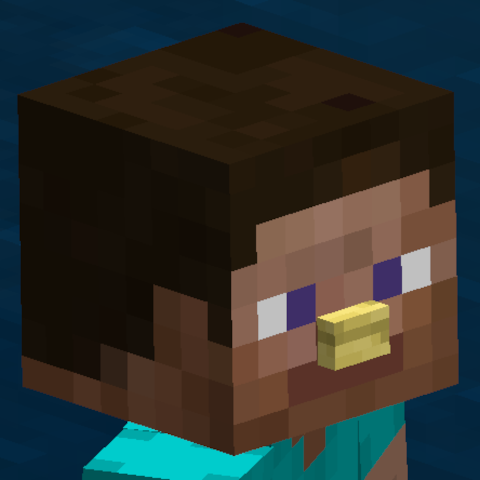   | 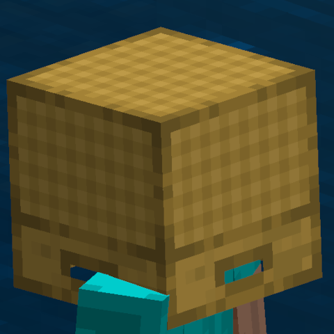  |
|                                      |                                |                             |
|               **Cake**               |           **Cobweb**           |    **Fire and Strikers**    |
|        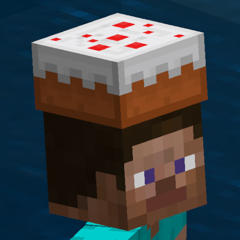        |   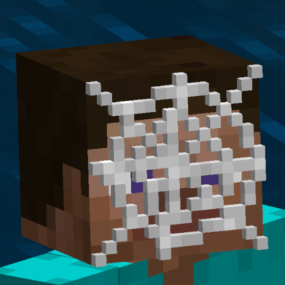   |   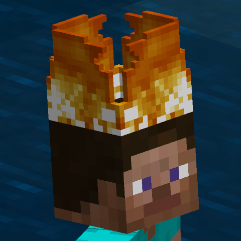    |
|                                      |                                |                             |
|           **Pumpkin Pie**            |          **Repeater**          |         **Saddle**          |
| 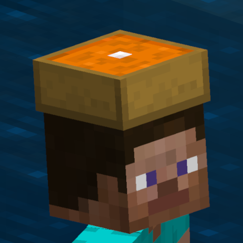 | 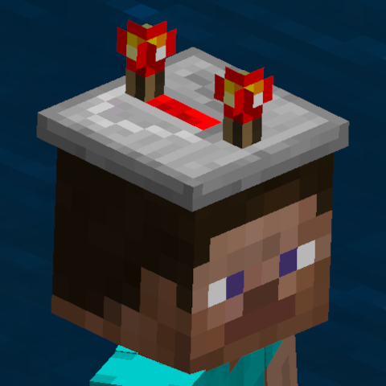 | 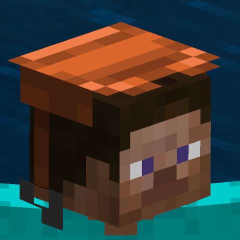  |
|                                      |                                |                             |
|               **Seat**               |           **Stick**            |         **Olivine**         |
|                |    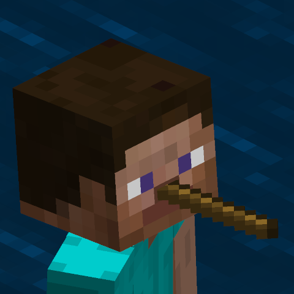    |  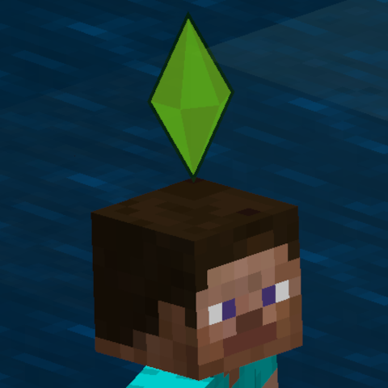   |

## Custom hats

To use:

1. Create a label that contains the listed name for a hat.
 - Eg. "Wyspr's Top Hat" to get a top hat
2. Name any block or item
3. Wear on head

|                            |                              |                                |
|:--------------------------:|:----------------------------:|:------------------------------:|
|                            |                              |                                |
|          **Box**           |          **Cheese**          |           **Mouse**            |
|        |  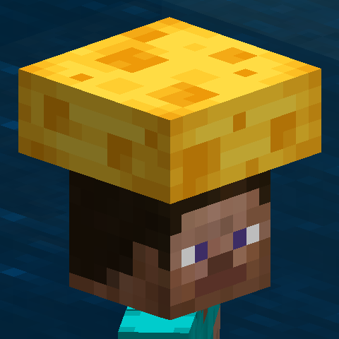  |  |
|                            |                              |                                |
|          **Chef**          |  **Builder, Construction**   |       **Mage, Magician**       |
|   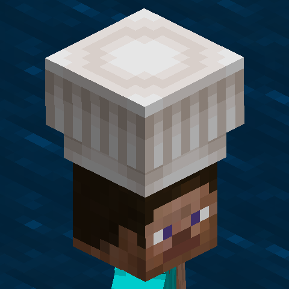   | 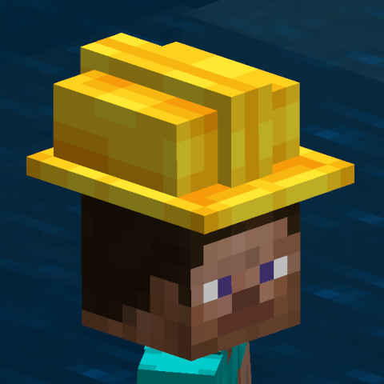 |     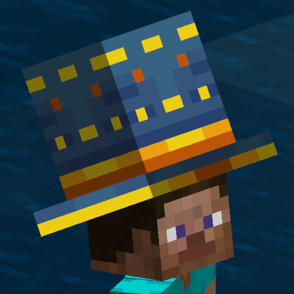     |
|                            |                              |                                |
|      **Sim, Plumbob**      |  **Pokemon, ash, ketchum**   |          **Top hat**           |
|        |     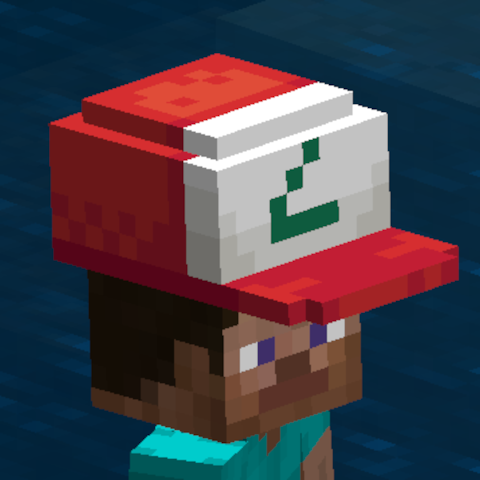     |  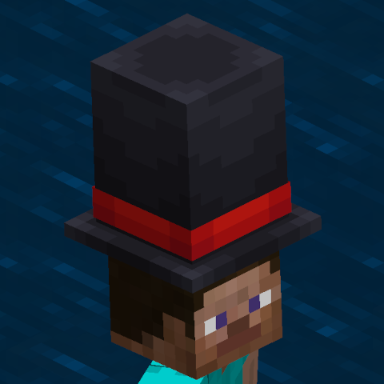   |
|                            |                              |                                |
|         **Witch1**         |          **Witch2**          |           **Witch3**           |   
| 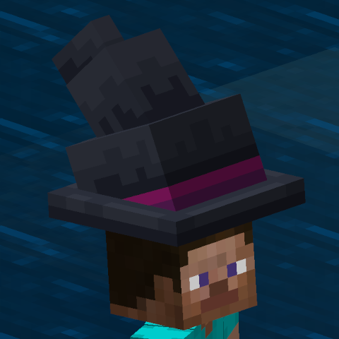 |  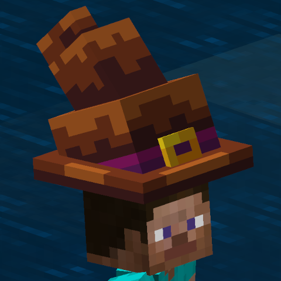  |      |
|                            |                              |                                |
|         **Witch4**         |          **Witch5**          |           **Witch6**           |   
| 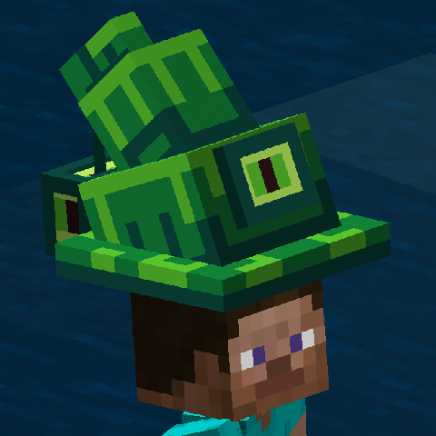 |  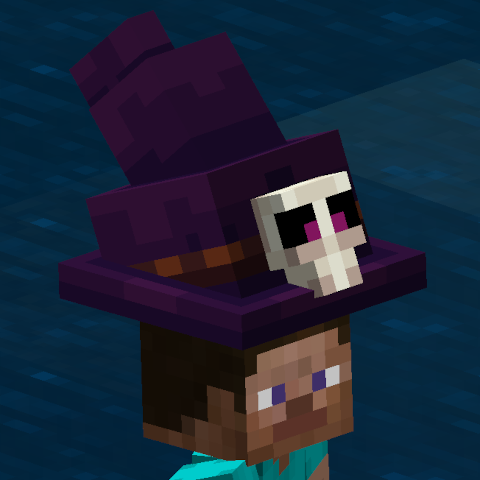  |   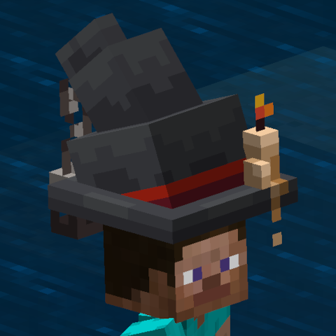   |
|                            |                              |
|         **Witch7**         |          **Witch8**          |
| 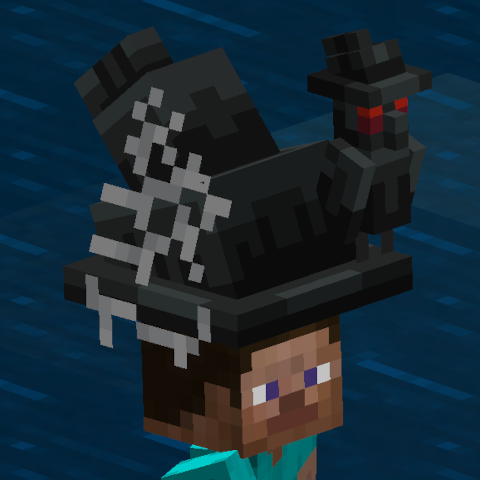 |  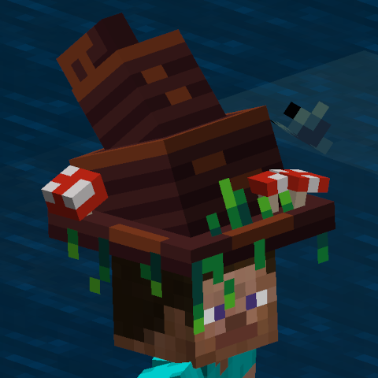  |

